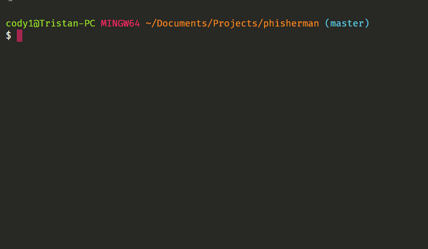

# Phisherman

Phisherman is a tool for spamming fake credentials to phishing websites (specifically, their endpoints). It generates random identites with random information, like names, emails, passwords and credit cards. Their information is made to be random, but also realistic, so that it can be hard to tell between a real and fake identity. The ultimate goal is to pollute the database of the phishing website with fake identities, so that it becomes harder for them to track real identities and sell them. Ultimately, scammers may have means to find out who is real and who is fake, but Phisherman is a tool to make it harder for them (and maybe scrap their databases!).

*Note: Phisherman is not related, in any way, to the phishing reporting service Phisherman.gg. The name collision is purely coincidental.*

## Packages

Phisherman consists of two packages, found in the `packages` directory: 
- [`phisherman`](packages/lib) (`@maxijonson/phisherman`) - a library that can be used to programmatically interact with the Phisherman API.
- [`phisherman-cli`](packages/cli) (`@maxijonson/phisherman-cli`) - a CLI tool that can be used to interact with the API from the command line.

## Demo

<!-- Insert demo.gif -->
